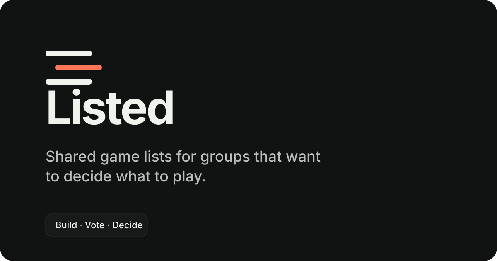

<div align="center">

# Listed

**Shared game lists for groups that want to decide what to play.**

[**English**](./README.md) · [Português (Brasil)](./README.pt-BR.md)

</div>



## Overview

Listed helps groups build a shared game list, see which options work for everyone, vote, filter the list, and choose what to play together.

The current MVP includes temporary sessions, anonymous Supabase identities, short invite codes, real-time rooms, manual game entries, Steam discovery, voting, ownership tracking, combined filters, random and weighted picks, owner/co-owner controls, QR sharing, multiple themes, en-US/pt-BR UI, and PostgreSQL persistence protected by RLS.

Permanent groups, OAuth/account upgrades, and more advanced group flows are planned and already have some schema groundwork.

## Tech stack

| Area | Stack |
| --- | --- |
| App | Next.js 16 App Router, React 19, TypeScript |
| UI | Tailwind CSS 4, shadcn/ui patterns, Radix UI, Lucide |
| Backend | Supabase Auth, PostgreSQL, Realtime, RLS |
| Testing | Vitest, Testing Library, Playwright |
| Deployment | Vercel, plus a Sites/vinext-compatible build |

## Getting started

### Requirements

- Node.js 22.13+
- npm 11+
- A Supabase project
- Docker only if you want to run the full Supabase stack locally

### Install and run

```bash
npm ci
cp .env.example .env.local
npm run dev:next
```

Open [http://localhost:3000](http://localhost:3000).

`npm run dev` starts the Sites/vinext-compatible development variant.

## Environment variables

Copy `.env.example` to `.env.local` and configure the values for your environment.

### Public

| Variable | Purpose |
| --- | --- |
| `NEXT_PUBLIC_APP_URL` | Canonical application URL |
| `NEXT_PUBLIC_SUPABASE_URL` | Supabase project endpoint |
| `NEXT_PUBLIC_SUPABASE_PUBLISHABLE_KEY` | Low-privilege Supabase publishable key |

### Server-only

| Variable | Purpose |
| --- | --- |
| `SUPABASE_SECRET_KEY` | Administrative Supabase client |
| `STEAM_WEB_API_KEY` | Official Steam catalog synchronization |
| `CRON_SECRET` | Bearer authentication for cron endpoints |

### Feature flags

| Variable | Purpose |
| --- | --- |
| `STEAM_PROVIDER_ENABLED` | Enables server-side Steam detail lookups |
| `STEAM_CATALOG_SYNC_ENABLED` | Enables protected incremental catalog sync |

Do not commit `.env.local`. Any `NEXT_PUBLIC_*` value is bundled for the browser, so privileged keys must never use that prefix.

## Supabase

Useful local commands:

```bash
npx supabase start
npx supabase db reset
npx supabase migration new change_name
npx supabase test db supabase/tests/rls.sql
```

Migrations live in `supabase/migrations/`. Deterministic game catalogs used by tests live under `tests/fixtures/`.

For quick sessions, enable **Authentication → Providers → Anonymous Sign-Ins** in Supabase. CAPTCHA/Turnstile should be enabled before production use.

## Steam catalog

Check catalog status with:

```bash
npm run steam:catalog:status
```

Steam catalog bootstrap and incremental sync run server-side. Search uses the local index, while missing visible artwork can be enriched on demand. Steam API keys are never exposed to the browser.

See [Steam integration](docs/steam-integration.md) for the full architecture and operational details.

## Useful commands

| Command | Purpose |
| --- | --- |
| `npm run dev:next` | Start the Next.js development server |
| `npm run dev` | Start the Sites/vinext-compatible dev server |
| `npm run lint` | Run ESLint |
| `npm run typecheck` | Run TypeScript checks |
| `npm test` | Run Vitest |
| `npm run test:e2e` | Run Playwright E2E tests |
| `npm run build:vercel` | Build the Vercel/Next.js target |
| `npm run build` | Build the Sites/Cloudflare Worker target |
| `npm run steam:catalog:status` | Inspect Steam catalog sync status |

For E2E tests, install Chromium once with:

```bash
npx playwright install chromium
```

## Project structure

```text
app/                 routes and request handlers
components/          UI, themes, games, and session components
features/            domain rules and hooks
i18n/                locale detection and typed dictionaries
lib/                 Supabase, Steam, environment, and validation
supabase/             migrations, seed, and RLS tests
tests/                unit, component, and E2E tests
docs/                 architecture and operational documentation
types/                domain and generated Supabase types
worker/               worker-specific integration code
```

## Documentation

- [Architecture](docs/architecture.md)
- [Database](docs/database.md)
- [Security](docs/security.md)
- [Steam integration](docs/steam-integration.md)
- [Deployment](docs/deployment.md)
- [Brand guidelines](docs/brand.md)
- [Product decisions](docs/product-decisions.md)
- [Music player roadmap](docs/music-player-roadmap.md)
- [Project progress](docs/progress.md)

## Known limitations

- Anonymous Sign-Ins must be enabled in the Supabase project used by the environment.
- Google, Discord, magic-link, and account-linking UI exists, but providers still require Supabase configuration.
- Steam store details rely on an undocumented endpoint and remain behind a feature flag.
- Full multi-context E2E coverage depends on a test Supabase environment with anonymous authentication enabled.

## Roadmap

For the current milestone-by-milestone status, see [`docs/progress.md`](docs/progress.md).
