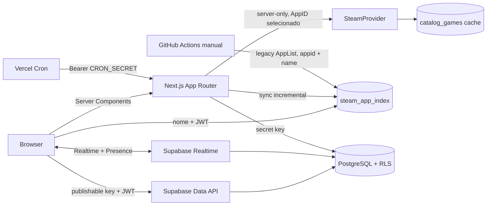

# Arquitetura

O Listed usa um shell Next App Router e ilhas client-side apenas para autenticação anônima, mutations e Realtime. Supabase é a fonte de verdade; estado local serve somente para UI e tema.

## Fronteiras

- `app/*/page.tsx`: composição e metadata; páginas de sessão são dinâmicas.
- `components/*`: interação e visual. Componentes não recebem secrets.
- `features/*`: regras puras e orquestração de sala.
- `lib/supabase/browser.ts`: cliente publishable lazy.
- `lib/supabase/server.ts`: cookies SSR; valida usuário em handlers.
- `lib/supabase/admin.ts`: secret key lazy e server-only.
- `lib/steam`: parser, normalização e adapters externos.

## Fluxos

Criação e ingresso usam RPCs transacionais com `auth.uid()`. Depois do ingresso, leituras e mutations passam pela Data API com RLS. A sala carrega snapshot inicial e assina mudanças de membros, jogos, votos, propriedade, sessão e resultados; Presence mantém apenas IDs efêmeros.

O autocomplete nunca chama a Steam: ele pesquisa `steam_app_index` com trigram. Apenas AppID, URL ou seleção resolvida passa pelo cache e pelo adapter de detalhes. O catálogo oficial é paginado por `last_appid` e `if_modified_since`, com checkpoint por página e histórico de execução.

Há três providers explícitos: `official_store_service` para atualização incremental preferencial, `legacy_public_applist` para o bootstrap temporário de `appid + name`, e `individual_lookup` para detalhes sob demanda. O fallback legado roda apenas por CLI/GitHub Actions, calcula hash da resposta, persiste lotes retomáveis e nunca participa da rota de busca live. Sem catálogo externo válido, jogos manuais, AppID e URL continuam disponíveis.

## Cache e deploy

Metadados armazenam `cache_expires_at`, `metadata_updated_at`, última tentativa/erro e status explícito. A confirmação Steam é mutation server-side; RLS continua sendo a última barreira de autorização. O build Vercel é Next nativo; o build Sites usa vinext/Cloudflare Worker a partir da mesma árvore App Router.
