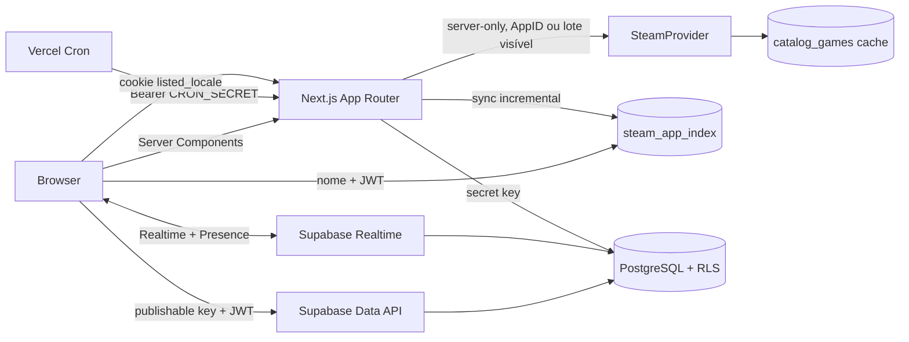

# Arquitetura

O Listed usa um shell Next App Router e ilhas client-side apenas para autenticação anônima, mutations e Realtime. Supabase é a fonte de verdade; estado local serve somente para UI e tema.

## Fronteiras

- `app/*/page.tsx`: composição e metadata; páginas de sessão são dinâmicas.
- `components/*`: interação e visual. Componentes não recebem secrets.
- `features/*`: regras puras e orquestração de sala.
- `lib/supabase/browser.ts`: cliente publishable lazy.
- `lib/supabase/server.ts`: cookies SSR; valida usuário em handlers.
- `lib/supabase/admin.ts`: secret key lazy e server-only.
- `lib/steam`: parser, normalização e adapters externos.
- `i18n`: detecção server-side, dicionários tipados pt-BR/en-US e provider client-side.

## Fluxos

Criação e ingresso usam RPCs transacionais com `auth.uid()`. Depois do ingresso, leituras e mutations passam pela Data API com RLS. A sala carrega snapshot inicial e assina mudanças de membros, jogos, votos, propriedade, configurações, bans, auditoria, sessão e resultados; Presence mantém apenas IDs efêmeros.

Papéis persistentes são `owner`, `co_owner` e `member`; `moderator` existe somente como leitura retrocompatível até uma migration posterior ao deploy. Promoção, remoção, ban, desbloqueio e transferência de ownership passam por RPCs `SECURITY DEFINER`, com `search_path` fixo, `auth.uid()` e audit log. Um índice parcial garante um owner ativo. O participante removido perde RLS imediatamente e o cliente confirma o estado em Realtime, ao retomar a aba e em intervalo defensivo.

Filtros são estado local serializado na URL. Opções do mesmo grupo usam OR; grupos usam AND. Categorias Steam são normalizadas por IDs numéricos estáveis, nunca por rótulos localizados. O compartilhamento gera o QR no browser e deriva a URL somente de `origin + /s/<code>`, sem proxy ou serviço externo.

O autocomplete nunca chama a Steam: ele pesquisa `steam_app_index` com trigram. A resposta textual inclui imagens e popularidade já armazenadas. Uma segunda requisição opcional recebe somente até 12 AppIDs visíveis sem cápsula, respeita cancelamento do cliente, usa concorrência 3 e passa pelo mesmo cache antes do adapter de detalhes. AppID e URL preservam o fluxo direto. O catálogo oficial é paginado por `last_appid` e `if_modified_since`, com checkpoint por página e histórico de execução.

Há dois providers operacionais: `official_store_service`, no host público da Web API, para bootstrap e atualização incremental; e `individual_lookup`, para detalhes sob demanda. O host de publisher fica reservado a integrações futuras com Publisher Web API Key. Jogos manuais, AppID e URL continuam disponíveis mesmo durante um sync.

A landing é um Server Component na fronteira dos dados. Ela resolve uma lista fixa somente de AppIDs no índice/cache já existente, guarda o resultado por 12 horas e entrega um payload público mínimo ao painel demonstrativo. A interação desse painel é local e ilustrativa; ela não atravessa as tabelas de sessão nem os agregadores de popularidade.

## Internacionalização

A rota permanece canônica e sem prefixo de idioma. `listed_locale` aceita apenas `pt-BR` e `en-US`; na ausência do cookie, o servidor negocia `Accept-Language`. Isso evita flash e divergência de hidratação, preserva links de convite e permite localizar metadata, manifest e `<html lang>` na primeira resposta. Componentes client-side recebem apenas o dicionário selecionado e usam `Intl` para pluralização, datas e números.

## Temas

Light, Dark, Dark Red, Purple e OLED Black compartilham os mesmos tokens semânticos. A preferência fica em `listed-theme` e, para contas permanentes, em `profiles.preferred_theme`. Preto OLED usa fundo `#000` sem alterar componentes individuais.

## Cache e deploy

Metadados armazenam `cache_expires_at`, `metadata_updated_at`, última tentativa/erro e status explícito. O índice guarda apenas URLs de imagem, status e score agregado; contagens de popularidade ficam no schema `private`. A confirmação Steam é mutation server-side; RLS continua sendo a última barreira de autorização. O build Vercel é Next nativo; o build Sites usa vinext/Cloudflare Worker a partir da mesma árvore App Router.
