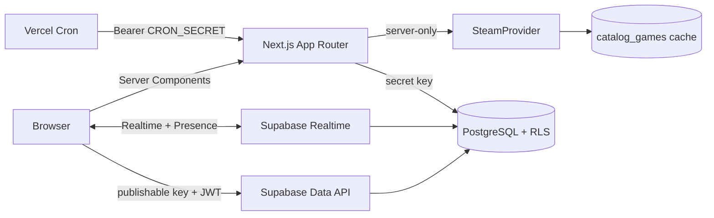

# Arquitetura

O JogaJunto usa um shell Next App Router e ilhas client-side apenas para autenticação anônima, mutations e Realtime. Supabase é a fonte de verdade; estado local serve somente para UI e tema.

## Fronteiras

- `app/*/page.tsx`: composição e metadata; páginas de sessão são dinâmicas.
- `components/*`: interação e visual. Componentes não recebem secrets.
- `features/*`: regras puras e orquestração de sala.
- `lib/supabase/browser.ts`: cliente publishable lazy.
- `lib/supabase/server.ts`: cookies SSR; valida usuário em handlers.
- `lib/supabase/admin.ts`: secret key lazy e server-only.
- `lib/steam`: parser, normalização e adapters externos.

## Fluxos

Criação e ingresso usam RPCs transacionais com `auth.uid()`. Depois do ingresso, leituras e mutations passam pela Data API com RLS. A sala carrega snapshot inicial e assina mudanças de membros, jogos, votos, propriedade, sessão e resultados; Presence mantém apenas IDs efêmeros.

O catálogo Steam oficial é paginado por `last_appid` e `if_modified_since`. Detalhes da Store são um adapter instável. Sem chave/API, jogos manuais continuam disponíveis.

## Cache e deploy

Metadados armazenam `cache_expires_at` e status explícito. O build Vercel é Next nativo; o build Sites usa vinext/Cloudflare Worker a partir da mesma árvore App Router.
