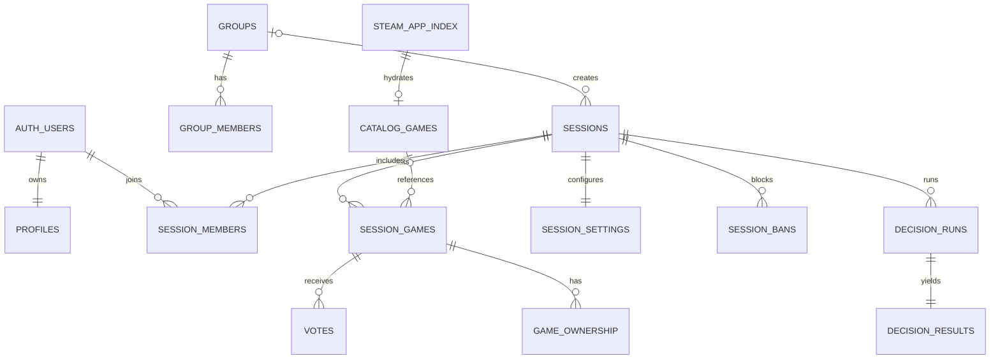

# Banco de dados

O schema inicial está em `supabase/migrations/20260720123940_initial_listed.sql`; o hardening posterior registra grants e índices adicionais; `20260720225653_steam_catalog_pipeline.sql` adiciona o pipeline Steam e `20260721122538_steam_catalog_full_search.sql` completa proveniência, bootstrap retomável, incremental e busca indexada.

## Integridade

- UUIDs internos; código público de seis caracteres sem `0/O/1/I/L`.
- Unicidade de membership, voto, AppID e jogo dentro da sessão.
- FKs possuem estratégia explícita e índices de cobertura.
- Trigger aplica voto único e impede votação fora do estado permitido.
- Grupos e sessões são entidades separadas; sessão de grupo referencia `groups`.
- Jogos manuais e Steam convergem em `session_games`; `catalog_games` é cache global.
- `steam_app_index` guarda descoberta leve, proveniência, disponibilidade, timestamps oficiais, geração de bootstrap, URLs/status de imagem e o score agregado de popularidade; `catalog_games` guarda detalhes normalizados e TTL.
- `private.steam_app_popularity` guarda apenas agregados por AppID: adições, votos, grupos/sessões distintas e recomendações Steam já hidratadas. Não pertence ao Data API público.
- `steam_catalog_sync_state` é singleton com completude, checkpoints full/incremental e lease; `steam_catalog_sync_runs` é histórico observável por execução.
- `session_settings` separa bloqueios de jogos/votos e delegações de co-owner do registro principal da sessão.
- `session_bans` preserva bloqueios por identidade, inclusive após remover o membership; `audit_logs` continua a fonte única de histórico.
- Um índice parcial garante somente um `owner` ativo por sessão. Transferência bloqueia sessão e memberships na mesma transação.

## RLS

Todas as tabelas públicas têm RLS. Sessões, membros, jogos, votos e propriedade exigem membership; votos e propriedade só podem usar `auth.uid()`; biblioteca é privada; catálogo é somente leitura para clientes; settings são legíveis por membros e bans/logs somente por administradores.

Administração escreve apenas por RPCs dedicadas. Owner pode promover/rebaixar co-owner e transferir propriedade; co-owner recebe somente capacidades delegadas. Expulsão limpa votos e declarações de acesso da pessoa na sessão. O join verifica ban ativo antes de reativar um membership.

Novos projetos Supabase não expõem tabelas automaticamente, portanto a migration concede privilégios por tabela além das policies.

## Rollback da administração

As migrations são aditivas e não apagam sessões, votos, jogos ou ownership.
Em caso de rollback do aplicativo, mantenha `session_settings`, `session_bans`,
os novos valores do enum e os logs: a versão anterior ignora esses objetos. Não
remova `co_owner` do enum enquanto houver memberships com esse papel. Uma
reversão futura do banco deve primeiro rebaixar co-owners de forma auditada,
revogar as RPCs novas e somente então remover objetos sem dependências, sempre
por uma migration corretiva nova.

Clientes autenticados podem selecionar índice/cache e executar apenas `search_steam_apps` como `security invoker`. Tabelas de sync não têm policy ou grant de cliente; escrita no índice/cache exige `service_role` server-only.

## Pesquisa e volume

- BTREE em `appid` e `normalized_name text_pattern_ops` para exato/prefixo.
- GIN `pg_trgm` em `normalized_name` para similaridade e contenção.
- Índice parcial considera apenas jogos disponíveis.
- Índices em `last_modified` e `(source, synced_at)` apoiam incremental e diagnóstico.
- `(image_status, image_updated_at)` parcial apoia reprocessamento de imagens sem tocar nos 175 mil detalhes.
- A busca reduz a no máximo 1.500 candidatos indexados, calcula `text_relevance_score`, `type_score`, `popularity_score` e `final_score`, e então limita/pagina. Empates terminam em nome e AppID para ordem determinística.
- Triggers em `session_games` e `votes` recalculam popularidade interna de forma idempotente; `record_steam_recommendations` é `security invoker` e executável somente por `service_role`.
- `catalog_source` separa a origem do índice (`legacy_public_applist` ou `official_store_service`) da origem dos metadados sob demanda (`individual_lookup`).
- O bootstrap legado mantém hash, lote, totais, lease e estados `syncing`, `partial`, `complete_legacy` e `failed`; seus RPCs são `security invoker` e executáveis apenas por `service_role`.
- `unaccent` fica no schema `extensions`; a função normalizadora fixa `search_path`.
