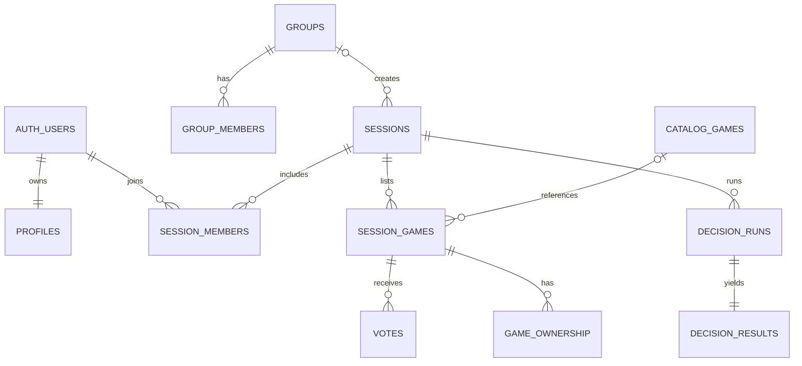

# Banco de dados

O schema inicial está em `supabase/migrations/20260720123940_initial_jogajunto.sql`; o hardening posterior registra grants e índices adicionais.

## Integridade

- UUIDs internos; código público de seis caracteres sem `0/O/1/I/L`.
- Unicidade de membership, voto, AppID e jogo dentro da sessão.
- FKs possuem estratégia explícita e índices de cobertura.
- Trigger aplica voto único e impede votação fora do estado permitido.
- Grupos e sessões são entidades separadas; sessão de grupo referencia `groups`.
- Jogos manuais e Steam convergem em `session_games`; `catalog_games` é cache global.

## RLS

Todas as tabelas públicas têm RLS. Sessões, membros, jogos, votos e propriedade exigem membership; votos e propriedade só podem usar `auth.uid()`; biblioteca é privada; catálogo é somente leitura para clientes; logs são visíveis apenas a owner/moderador.

Novos projetos Supabase não expõem tabelas automaticamente, portanto a migration concede privilégios por tabela além das policies.
