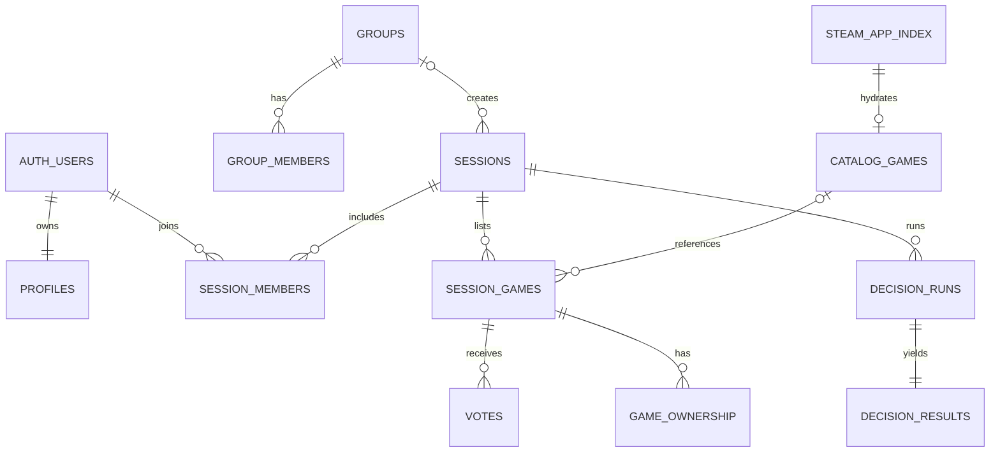

# Banco de dados

O schema inicial está em `supabase/migrations/20260720123940_initial_listed.sql`; o hardening posterior registra grants e índices adicionais; `20260720225653_steam_catalog_pipeline.sql` adiciona o pipeline Steam e `20260721122538_steam_catalog_full_search.sql` completa proveniência, bootstrap retomável, incremental e busca indexada.

## Integridade

- UUIDs internos; código público de seis caracteres sem `0/O/1/I/L`.
- Unicidade de membership, voto, AppID e jogo dentro da sessão.
- FKs possuem estratégia explícita e índices de cobertura.
- Trigger aplica voto único e impede votação fora do estado permitido.
- Grupos e sessões são entidades separadas; sessão de grupo referencia `groups`.
- Jogos manuais e Steam convergem em `session_games`; `catalog_games` é cache global.
- `steam_app_index` guarda descoberta leve, proveniência, disponibilidade, timestamps oficiais e geração de bootstrap; `catalog_games` guarda detalhes normalizados e TTL.
- `steam_catalog_sync_state` é singleton com completude, checkpoints full/incremental e lease; `steam_catalog_sync_runs` é histórico observável por execução.

## RLS

Todas as tabelas públicas têm RLS. Sessões, membros, jogos, votos e propriedade exigem membership; votos e propriedade só podem usar `auth.uid()`; biblioteca é privada; catálogo é somente leitura para clientes; logs são visíveis apenas a owner/moderador.

Novos projetos Supabase não expõem tabelas automaticamente, portanto a migration concede privilégios por tabela além das policies.

Clientes autenticados podem selecionar índice/cache e executar apenas `search_steam_apps` como `security invoker`. Tabelas de sync não têm policy ou grant de cliente; escrita no índice/cache exige `service_role` server-only.

## Pesquisa e volume

- BTREE em `appid` e `normalized_name text_pattern_ops` para exato/prefixo.
- GIN `pg_trgm` em `normalized_name` para similaridade e contenção.
- Índice parcial considera apenas jogos disponíveis.
- Índices em `last_modified` e `(source, synced_at)` apoiam incremental e diagnóstico.
- `unaccent` fica no schema `extensions`; a função normalizadora fixa `search_path`.
